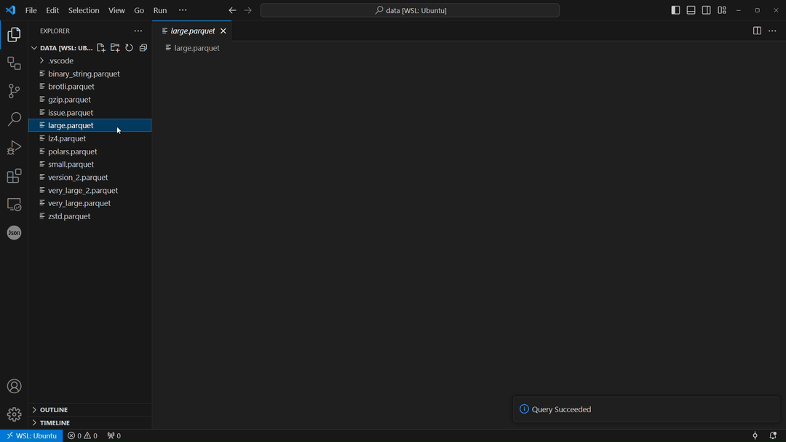
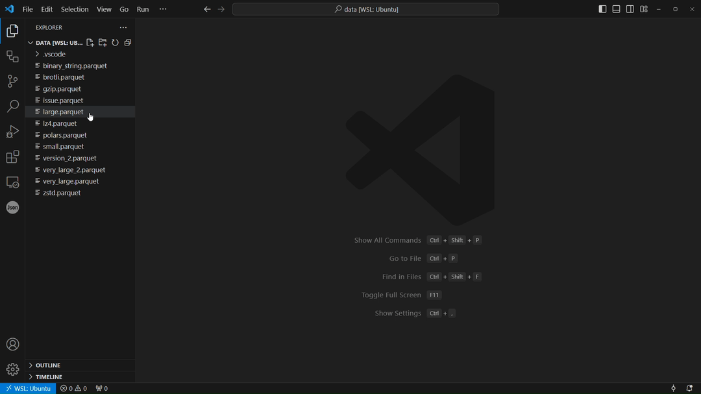
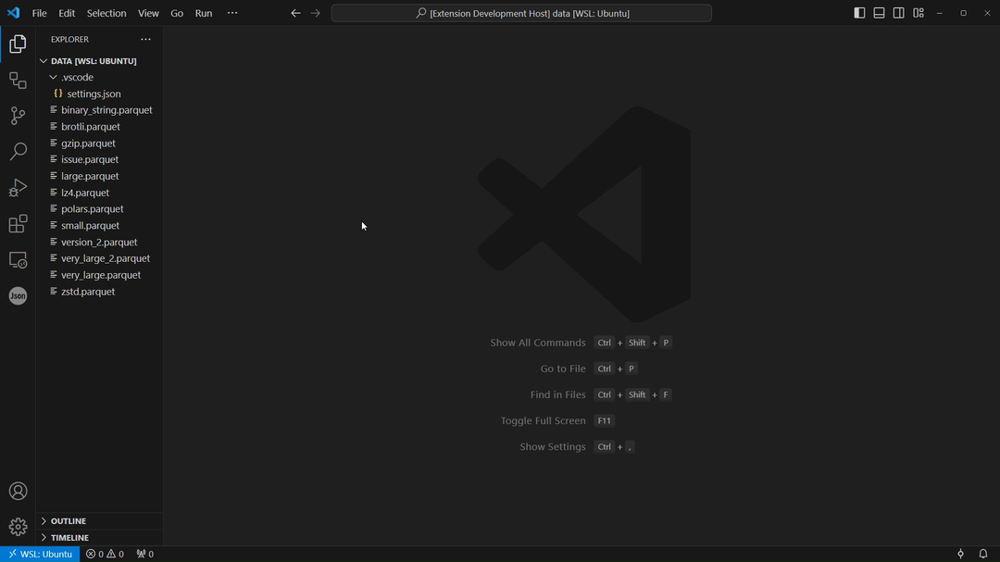
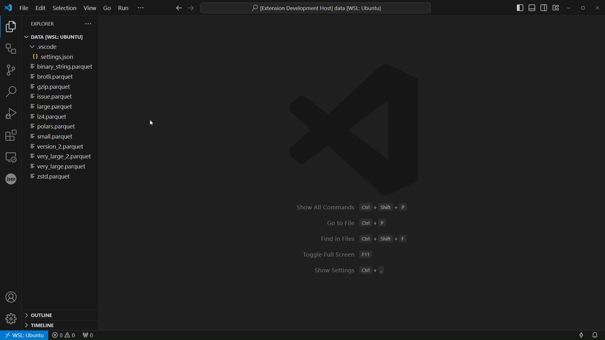

# Parquet Visualizer
Parquet Visualizer is a tool that helps you easily query and inspect parquet files fast.

## What can I do with Parquet Visualizer?
You can use Parquet Visualizer to:
- query the data with SQL
- visually inspect parquet files
- inspect struct values easily by clicking on the cell
- inspect the schema
- inspect the metadata

### Run SQL Queries on a Parquet File
You can query a parquet file with DuckDB SQL. You can also paginate the query result or change the page size.

### Inspect Data
You can inspect the binary data of parquet files in a human readable tabular format with pagination. You can also change the page size.

### Inspect Struct Value
You can easily inspect complex struct values by clicking on the cell, which shows a popup containing the value of the struct.

### Inspect Schema
You can inspect the schema of the parquet file by clicking on the Schema tab, in which you can paginate if the file has many columns.

You can also inspect the struct type by clicking on the cell, which will show a popup containing the struct data type.

### Inspect Metadata
You can inspect the metadata in tabular format by clicking on the Metadata tab.

## Configuration
The following configuration options are available:

|name|default|description|
|----|-------|-----------|
|`parquet-visualizer.backend`|`duckdb`| Backend for reading the parquet file. Options: `duckdb`, `parquet-wasm`|
|`parquet-visualizer.defaultPageSizes`|[20, 50, 100, 500]|Set the default page size for data and query tab.|
|`parquet-visualizer.defaultQuery`|`SELECT *\r\nFROM data\r\nLIMIT 1000;`|Default SQL query for parquet file. The table `data` should remain the same.|

## Parquet backends
This extension supports two different types of backends for visualizing and querying parquet files.

### DuckDB
[DuckDB](https://duckdb.org/docs/index) is the primary backend used for uncompressed and compressed parquet files (except for the BROTLI compression codec.)

### Parquet-wasm
The backend that loads the Parquet files uses the [parquet-wasm](https://kylebarron.dev/parquet-wasm) library.

## Frontend
The tables of the frontend are powered by [tabulator](https://tabulator.info/).

The query editor of the frontend is powered by [ace] (https://github.com/ajaxorg/ace).

