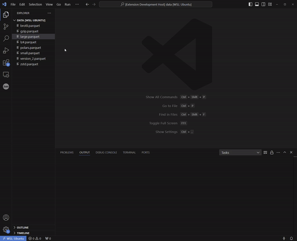

# parquet-visualizer
Explore parquet files visually with SQL and with a table paginator.

## Features
- Visualizes the binary parquet file in readable table format
- Query parquet files with SQL
- Paginate through parquet file
- Inspect the parquet file's schema
- Inspect the parquet file's metadata
- Open multiple files simultanuously
- Inspect complex objects by clicking on a table cell
- Select columns to visualize in table

## Parquet backend
The backend that loads the Parquet files uses the [parquet-wasm](https://kylebarron.dev/parquet-wasm) library.

## Frontend
The frontend is powered by [tabulator](https://tabulator.info/).

